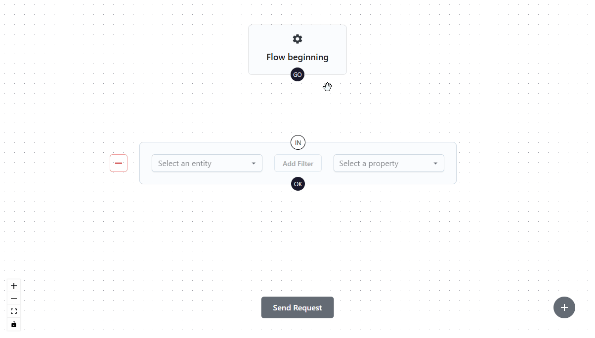

# Data Picker

The Data Picker is a powerful tool for selecting and filtering data from SAP SuccessFactors. This guide explains how to use it effectively with practical examples.

## Overview

The Data Picker is a visual interface that allows you to build complex data queries by combining entities, filters, and properties. It provides a drag-and-drop interface for creating data flows that can be used in your UI components.

## Example Data Flow Configurations

### 1. Simple Flow with a Single Entity and Selected Property

This example demonstrates how to fetch all candidateIds from the backend:

1. Connect the Entity Section to the Flow start
2. Select the Candidate entity
3. Choose the candidateId property
4. Click "Send Request" and verify the results

### 2. Simple Flow with a Basic Filter

Building on the previous example, we'll now fetch the address of a specific candidate:

1. Connect the Entity Section to the Flow start
2. Select the Candidate entity
3. Click "Add Filter"
4. Configure the filter (in this example, candidateId = 81)
5. Save the filter
6. Select the address property in the Entity Section
7. Click "Send Request" and verify the results

### 3. Multiple Properties and Navigation Property Expansion

This example shows how to expand navigation properties and select multiple properties:

1. Connect the Entity Section to the Flow start
2. Select the JobRequisition entity
3. Choose the hiringManager property (a navigation property that links to another entity)
4. In the accordion that opens, select properties of the hiringManager
5. For the hiringManager, we'll select firstName and lastName
6. Click "Send Request" and verify the results

### 4. Complex Filter with Navigation Properties

This example demonstrates creating a more complex filter using navigation properties:

1. Connect the Entity Section to the Flow start
2. Select the JobRequisition entity
3. Click "Add Filter"
4. Configure the first filter condition by selecting the age property and setting the filter to > 900
5. Add another condition using the "Add Condition" button
6. In the new condition, select the hiringManager property. Since hiringManager is a navigation property, an additional autocomplete will appear for selecting the hiringManager's property
7. Select the hiringManager's lastName and set the condition to = "TU"
8. Save the filter
9. Select the coordinator property in the Entity Section
10. Since coordinator is a navigation property, select its firstName
11. Click "Send Request" and verify the results

### 5. Complex Flow Using Results from One Request in Another

This example shows how to create a flow with multiple entity sections, where the results from one request are used as a filter in another:

1. Connect the Entity Section to the Flow start
2. Select the desired entity
3. Select the required property without creating a filter
4. Optionally, click "Send Request" to verify the results
5. Use the plus button in the bottom right to add a second Entity Section
6. Instead of connecting to the flow start, connect the "OK" node of the first entity section to the "IN" button of the new Entity Section
7. Select the desired entity in the new Entity Section
8. Click "Add Filter" in the new Entity Section
9. Create a condition with the desired property
10. In the filter value dropdown, select one of the values fetched by the first Entity Section
11. Save the filter configuration
12. Select the desired property
13. Click "Send Request" and verify the results

## Building Your Own Data Flow

When building your own data flow, consider these key points:

1. Start with a clear understanding of what data you need
2. Choose the appropriate entity for your use case
3. Use filters to narrow down the results
4. Select only the properties you need
5. Use navigation properties to access related data
6. Test your flow with the "Send Request" button before using it in your UI

## Best Practices

1. **Performance Optimization**

   - Select only the properties you need
   - Use specific filters to limit the result set
   - Avoid unnecessary navigation property expansions

2. **Data Flow Structure**

   - Keep flows as simple as possible
   - Use meaningful names for your flows
   - Document complex flows with comments

3. **Error Handling**
   - Always test your flows before using them in production
   - Handle potential null values in navigation properties
   - Consider edge cases in your filters

## Troubleshooting

Common issues and their solutions:

1. **Request Failures**

   - Check entity and property names
   - Verify filter syntax
   - Ensure proper connection between entity sections

2. **Navigation Property Issues**

   - Verify the relationship between entities
   - Check if the navigation property exists
   - Ensure proper property selection in expanded entities

3. **Filter Problems**
   - Verify filter syntax
   - Check data types of filter values
   - Ensure proper operator usage

## Advanced Features

### 1. Creating Complex Filters

To enable comprehensive filtering capabilities, the Data Picker supports the creation of complex filters with nested conditions. For example, you can create scenarios like `((conditionX = 1 AND conditionY = 2) OR (conditionZ = 3 AND conditionA = 4))`. To build such complex filters in the filter modal, use Condition Groups. The modal provides two buttons at the bottom: "Add Condition" and "Add Condition Group".

Key features of complex filtering:

- Multiple condition groups can be connected using the same logical operator
- Within a condition group, you can add any number of conditions using the same logical operator
- While not every possible filter combination can be created, this structure supports most common filtering scenarios
- Condition groups help organize complex logical expressions in a clear and maintainable way

### 2. Expand Properties to Multiple Levels

As we've seen in previous examples, you can expand navigation properties to access related data, such as selecting the first name of a hiring manager from a JobRequisition. This capability extends to deeply nested properties as well. For instance, you could access the address line 1 of a manager's manager's manager's manager under a User entity.

Key benefits of multi-level property expansion:

- Access data from deeply nested relationships
- Build complex data queries without multiple requests
- Maintain data context through the relationship chain
- Efficiently retrieve related information in a single request
